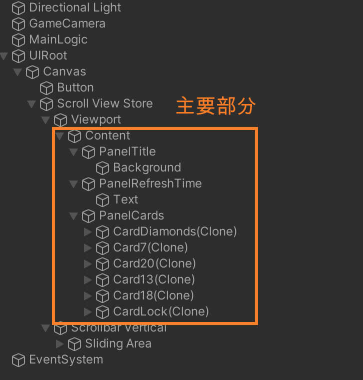
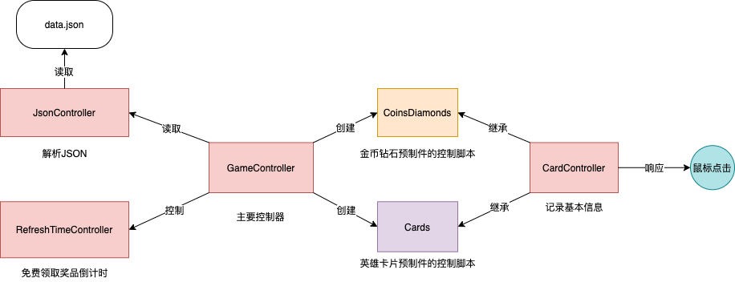

- Hierarchy结构：主要部分分为三个Panel(PanelTitle、PanelRefreshTime、PanelCards)，具体如下：  

- 项目共有7个prefeb, 在Hierarchy中的对应关系为：  
   1. 钻石 --> CardDiamends(Clone)
   2. 金币 --> 未显示
   3. 卡片7 --> Card7(Clone)
   4. 卡片13 --> Card13(Clone)
   5. 卡片18 --> Card18(Clone)
   6. 卡片20 --> Card20(Clone)
   7. 被锁卡片 --> CardLock(Clone)

- 代码共有6个类，关系与结构如下：  
