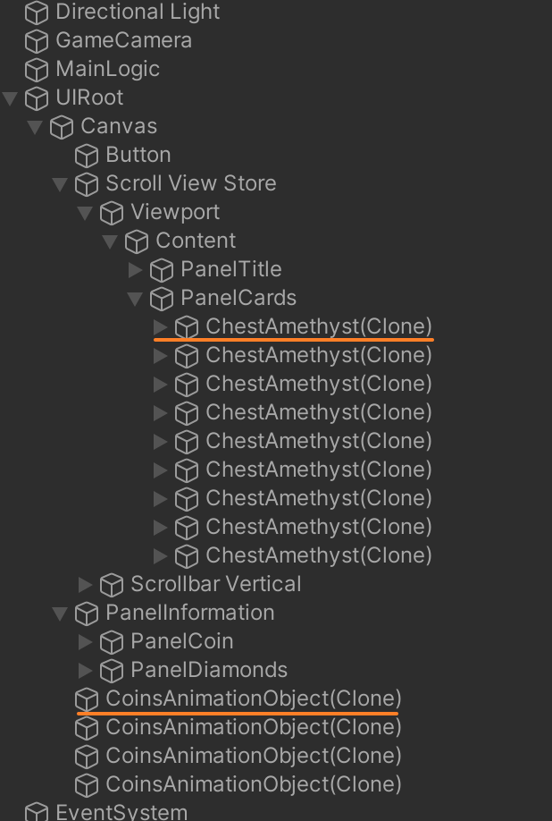
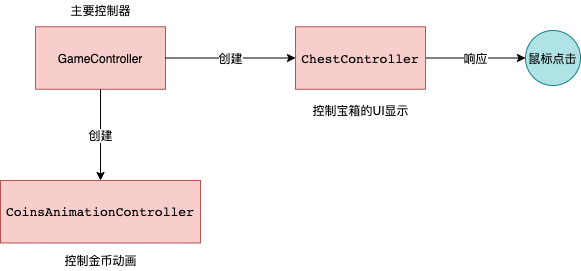

- Hierarchy结构具体如下：  

- 项目共有2个prefeb, 在Hierarchy中的对应关系为：  
   1. 宝箱 --> ChestAmethyst(Clone)
   2. 金币 --> CoinsAnimationObject(Clone)

- 代码共有3个类，关系与结构如下：  
  

   - GameController 的功能包括： 
      - 创建宝箱UI、动画UI  
      - 监控钻石、金币数量  